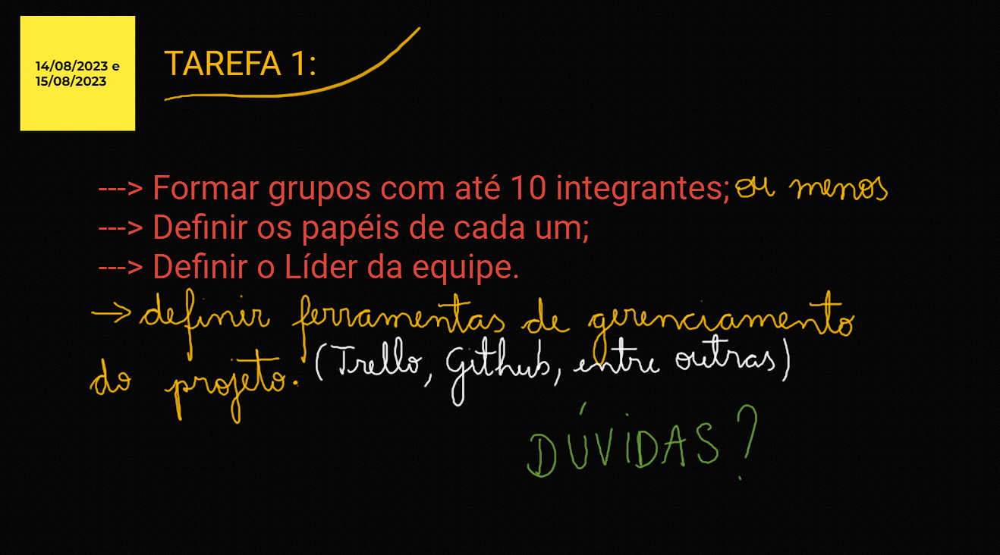

TAREFAS AGOSTO / SETEMBRO

---> Formar grupos com até 10 integrantes;

---> Definir os papéis de cada um;

---> Definir o Líder da equipe.

DEFINIR FERRAMENTAS DE GERENCIAMENTO DE PROJETO (TRELLO, GITHUB, ETC.)

INTEGRANTES (6)

FELIPPE BOSCO DA CRUZ

MANUEL

CARLOS HENRIQUE

FELIPE

WILLIAM

IGOR

TEMAS

TEMA 1

WEBSITE (API?, HOSPEDAGEM?, DOMINIO?, TEMA?, FUNCIONALIDADES?)/ APIs (QUAIS?, LIMITE DE USO?, BANCO?)

TEMA 2

GAME (TEMA?, LINGUAGEM?, ENGINE?, HOSPEDAGEM?) WEBSITE (API?, HOSPEDAGEM?, DOMINIO?, DESIGN?)

SOBREVIVENCIA / TERROR (VISAO 2.5D?, 1 PESSOA?, GAME DESIGN?, MAPA?, CRIATURAS?, ANIMAÇÕES?)